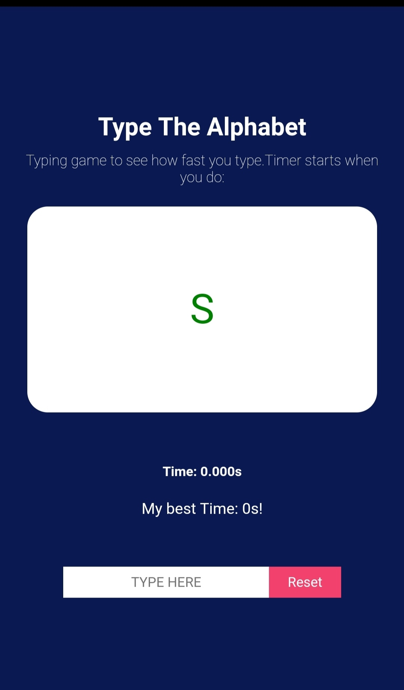
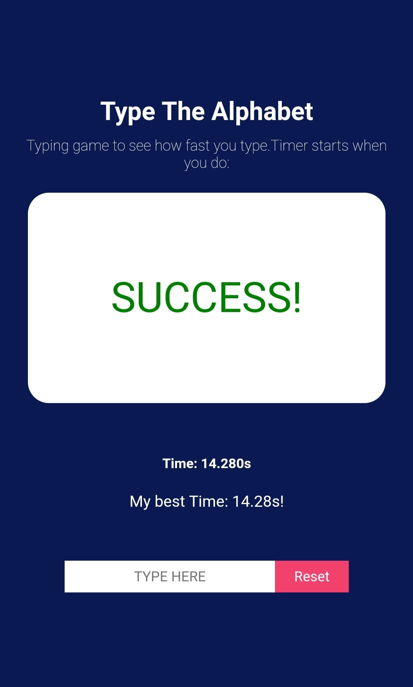
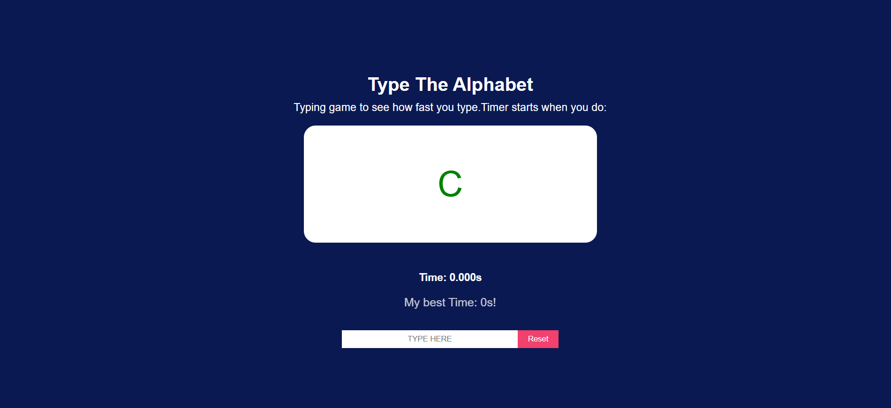

<!-- ABOUT THE PROJECT -->
<h1>Alphabet Typing Game</h1>
 
<h2 style="text-align:center ; background: black;color: white;">Game Page</h2>

  
  

 <h2 style="text-align:center ; background: black;color: white;">Success</h2>

 

    
 <h2 style="text-align:center ; background: black;color: white;">Failure</h2>
 
      
  <h2 style="text-align:center ; background: black;color: white;">Desktop Game Page</h2>
        
 

           

  
<h1>🌟 Live link</h1>
  
<a href="https://alphabetgame2812.netlify.app/" target="_blank">Alphabet Typing Game</a>
  
<h1>👨‍💻 Tech stack</h1>

I made this projects using  Tech stacks 
<h1>React
</h1>

<h1>✍️ Contributing</h1>
Interested in contributing to this project? Thanks so much for your interest! We are always looking for improvements to the project and contributions from open-source developers are greatly appreciated.

<h1>⚠️ License</h1>
The project is free and open-source software licensed under the GNU General Public License v3.0. and distributed under Creative Commons license (CC BY-SA 4.0 International).

 

<h1>💛 @Shubham Singhal</h1>
